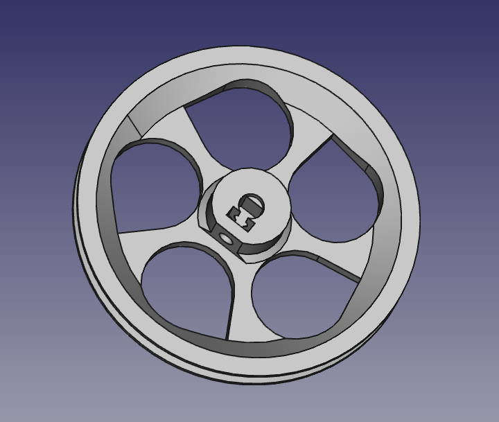

# Escornabot Compactus

## Wheel with a couple of changes

Original design [from Xoan here][ORI01].

- Distance from nut and edge of the wheel axis is longer.
- Drops where rotated to allow the access to the screw.

- [STL wheel right][WHE01]
- [STL wheel left][WHE02]

[ORI01]: https://github.com/xoan/escornabot/tree/master/hardware/3d-model/src
[WHE01]: wheel-r.stl
[WHE02]: wheel-l.stl
